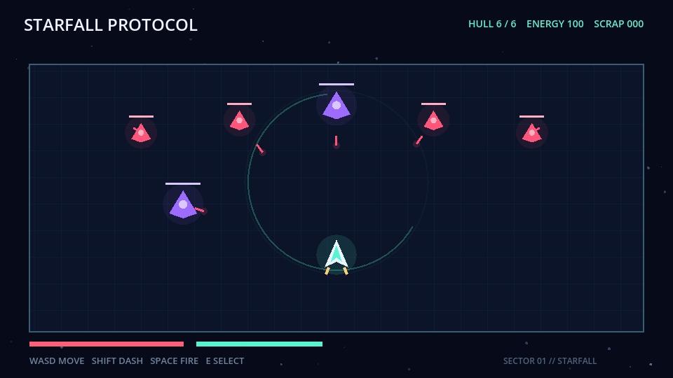

# GamePhanes

> **Terminal-Bench for interactive software coding agents.**
>
> A Godot-first benchmark runner for putting coding agents in task workspaces, capturing terminal trajectories, and evaluating real runtime behavior.
>
> **面向交互软件 Coding Agent 的 Terminal-Bench。** GamePhanes 将 Agent 放进游戏工程任务空间，记录 Terminal 轨迹，并通过真实运行时反馈评估结果。

[Project homepage / 项目主页](https://gamephanes.github.io/) · [Showcase / 游戏展示](#showcase--游戏展示) · [Architecture / 架构](docs/architecture.md) · [Trajectory contract / 轨迹契约](docs/trajectory.md) · [Open-core boundary / 开源边界](docs/open-core.md)



## What is GamePhanes? / 项目简介

Traditional terminal benchmarks evaluate command-line workspaces. Interactive software adds another requirement: the artifact must launch, accept input, change runtime state, and produce the intended user-visible result. GamePhanes extends the terminal-task loop with an executable game runtime and deterministic behavioral evaluation.

传统 Terminal Benchmark 通常评估命令行工作空间；交互软件还必须真正启动、响应输入、改变运行时状态并呈现预期结果。GamePhanes 将 Terminal 任务循环延伸到可执行游戏运行时和确定性行为评测：

```text
Understand -> Plan -> Build -> Run -> Exercise -> Observe -> Repair -> Evaluate
理解需求   -> 规划 -> 构建 -> 运行 -> 执行验证 -> 观测 -> 修复 -> 评测
```

The benchmark unit is a task workspace. An agent receives a starter project and a goal, works through a restricted terminal session, and submits the modified project. The evaluator owns the probing inputs and hidden checks; the agent does not need to learn a player policy.

Benchmark 的基本单位是一个任务工作空间。Agent 获得初始工程和目标，在受限 Terminal 会话中完成工作并提交修改后的工程；交互探针和隐藏检查由评测器控制，Agent 不需要学习玩家操作策略。

GamePhanes is agent-agnostic: it does not need to own the coding model or agent loop. A coding agent modifies a candidate project; GamePhanes runs the result, drives evaluator-controlled interactions, records runtime feedback, and produces a machine-readable score for the next repair step.

GamePhanes 不绑定具体模型或 Agent 框架。Coding Agent 修改候选工程后，GamePhanes 负责运行产物、由评测器驱动真实交互、记录运行时反馈，并生成可用于下一轮修复的机器可读评分。

### What it is, and what it is not / 它是什么，不是什么

GamePhanes is for agents that write and repair interactive software. The agent action is a code edit, scene change, asset/config change, or debugging command. The game is the executable feedback surface: it exposes build errors, runtime logs, state transitions, screenshots, and assertion results.

GamePhanes 面向的是“写游戏、改游戏、调试游戏”的 Coding Agent。Agent 的动作是代码修改、场景修改、资产或配置修改，以及调试命令；游戏是可执行的反馈面，暴露构建错误、运行时日志、状态变化、截图和断言结果。

It is not a benchmark for an agent that controls a player and tries to win the game. Any keyboard or controller input in a harness is evaluator-controlled probing used to obtain feedback about the candidate code. The target trajectory is `edit -> run -> feedback -> diagnose -> repair`, not a gameplay policy trajectory.

它不是让 Agent 控制玩家、追求通关的游戏操作 Benchmark。Harness 中的键盘或手柄输入由评测器控制，只用于探测候选代码并产生反馈；目标轨迹是“修改 -> 运行 -> 反馈 -> 诊断 -> 修复”，而不是游戏策略轨迹。

The current `v0.1` foundation provides / 当前 `v0.1` 基础版本提供：

- Godot environment discovery / Godot 环境探测；
- JSON benchmark task validation / JSON benchmark 任务校验；
- Temporary project copies with Playtest harness injection / 临时工程副本与 Playtest harness 注入；
- Godot headless import and runtime execution / Godot headless 导入和运行；
- Structured runtime events over NDJSON logs / 基于 NDJSON 日志的结构化运行时事件；
- Deterministic assertions and scoring without an LLM judge / 不依赖 LLM Judge 的确定性断言与评分报告；
- A model-agnostic Coding Agent Adapter and validated trajectory recorder / 与模型无关的 Coding Agent Adapter 和经过校验的轨迹记录器；
- Terminal command trajectory records with stdout, stderr, exit codes, and costs / 包含 stdout、stderr、退出码和成本的 Terminal 命令轨迹记录；
- Six polished 2D/3D showcase slices with external Playtests / 六款带独立 Playtest 的精致 2D/3D 游戏切片。

## Open Core and Production Layer / 开源核心与生产层

The public repository is the trust layer: task contracts, the local runner, example projects, reference harnesses, deterministic assertions, and a reproducible demo suite are open for inspection and extension.

开源仓库承担“可信基础层”：任务契约、本地 Runner、示例工程、参考 Harness、确定性断言和可复现 Demo Suite 都可以检查与扩展。

The production direction builds on that foundation with sealed Terminal sessions, private task suites, hidden evaluators, versioned rollout traces, failure taxonomies, and customer-specific environments. These layers are intended for coding-agent evaluation and post-training data rather than being published as benchmark answers.

生产层将在此基础上提供封闭 Terminal Session、私有任务集、隐藏评测器、版本化 Rollout 轨迹、失败分类和客户定制环境，用于 Coding Agent 评测与后训练数据；这些内容不会作为公开 Benchmark 答案发布。

| Layer / 层 | Public repository / 开源仓库 | Production direction / 生产方向 |
|---|---|---|
| Environment / 环境 | Runner, task schema, trajectory recorder, example projects / Runner、任务格式、轨迹记录器、示例工程 | Sealed Terminal sessions, isolated workers, quotas, engine images / 封闭 Terminal Session、隔离 Worker、资源配额、引擎镜像 |
| Evaluation / 评测 | Reference harnesses and deterministic assertions / 参考 Harness 与确定性断言 | Hidden tasks, private evaluators, anti-overfitting checks / 隐藏任务、私有评测器、抗过拟合检查 |
| Data / 数据 | Example reports and reproducible runs / 示例报告与可复现运行 | Successful and failed rollouts, repair trajectories, failure labels / 成功与失败 Rollout、修复轨迹、失败标签 |

The detailed boundary is documented in [`docs/open-core.md`](docs/open-core.md). Public interfaces and scoring principles stay inspectable; private task content, answers, evaluator implementations, and production rollouts do not enter this repository.

详细边界见 [`docs/open-core.md`](docs/open-core.md)。公开接口与评分原则保持可检查；私有任务内容、答案、评测实现和生产 Rollout 不进入本仓库。

## Positioning and Related Work / 定位与相关工作

[GameDevBench](https://arxiv.org/abs/2602.11103) and [GameCraft-Bench](https://arxiv.org/abs/2606.17861) have already established game-development agent benchmarking with large Godot task suites. GamePhanes does not claim to be the first game coding benchmark.

[GameDevBench](https://arxiv.org/abs/2602.11103) 和 [GameCraft-Bench](https://arxiv.org/abs/2606.17861) 已经通过大规模 Godot 任务集建立了游戏开发 Agent Benchmark。GamePhanes 不宣称自己是首个游戏 Coding Benchmark。

GamePhanes focuses on the infrastructure around repeated production evaluation: agent-neutral execution, deterministic behavioral evidence, private task variants, hidden evaluators, versioned rollout traces, and customer-specific environments. The public demo suite proves the contract; it is not presented as a replacement for those research benchmarks.

GamePhanes 聚焦可持续生产评测所需的基础设施：与 Agent 无关的执行层、确定性行为证据、私有任务变体、隐藏评测器、版本化 Rollout 轨迹和客户定制环境。公开 Demo Suite 用于证明契约可运行，而不是取代上述研究 Benchmark。

## Golden Demo / 黄金 Demo

**Starfall Protocol / 星坠协议** is the reference vertical slice for the GamePhanes coding agent. It is an original 2D top-down action game designed for an 8–12 minute session: clear a data-driven encounter, choose one of three upgrades, then defeat the Oracle boss. Its visuals are procedural and MIT-licensed; no third-party code or game assets are copied.

**Starfall Protocol / 星坠协议** 是 GamePhanes Coding Agent 的黄金 Demo。它是一款原创的 2D 俯视角动作游戏，单局约 8–12 分钟：清理数据驱动的敌群、从三项协议中选择升级，再击败 Oracle Boss。视觉由程序化绘制，代码与工程采用 MIT 许可，不复制第三方代码或游戏资产。

It is playable on the [homepage](https://gamephanes.github.io/#showcase) and has a standalone task with six deterministic assertions / 它可以在[主页](https://gamephanes.github.io/#showcase)直接试玩，并配有包含六项确定性断言的独立任务：

```powershell
node ./bin/gamephanes.js run ./benchmark/tasks/starfall-protocol.json --godot C:\path\to\godot.exe
```

## Showcase / 游戏展示

These are runnable Godot reference environments, not static mockups. Their gameplay systems are deliberately used as feedback surfaces: movement, combat, physics state, resource strategy, wave simulation, 3D rendering, external input, and deterministic evaluation all give a coding agent observable consequences after it changes the project.

它们是真正可运行的 Godot 参考环境，不是静态概念图。六款游戏把移动、战斗、物理状态、资源策略、波次模拟、3D 渲染、外部输入和确定性评测变成 Coding Agent 修改代码后可以收到的反馈。

| Game / 游戏 | Play online / 在线试玩 | Verified loop / 已验证闭环 |
|---|---|---|
| [Starfall Protocol / 星坠协议](examples/starfall-protocol) | [Play / 试玩](https://gamephanes.github.io/play/starfall-protocol/) | Clear encounter, choose upgrade, defeat Oracle / 清理敌群、选择升级、击败 Oracle |
| [Neon Relay](examples/neon-relay) | [Play / 试玩](https://gamephanes.github.io/play/neon-relay/) | Run, jump, collect three shards, finish / 奔跑、跳跃、收集三枚碎片、抵达终点 |
| [Last Signal](examples/last-signal) | [Play / 试玩](https://gamephanes.github.io/play/last-signal/) | Reposition, pulse, clear four threats / 移动、脉冲攻击、清除四个威胁 |
| [Gravity Lab](examples/gravity-lab) | [Play / 试玩](https://gamephanes.github.io/play/gravity-lab/) | Flip gravity, stabilize core, unlock exit / 反转重力、稳定核心、解锁出口 |
| [Tiny Bastion](examples/tiny-bastion) | [Play / 试玩](https://gamephanes.github.io/play/tiny-bastion/) | Build towers, start wave, defend keep / 建塔、开启波次、守住城堡 |
| [Rift Arena](examples/rift-arena) | [Play / 试玩](https://gamephanes.github.io/play/rift-arena/) | Move in 3D, strike warden, stabilize rift / 3D 移动、攻击守卫、稳定裂隙 |

All six currently pass `28/28` deterministic assertions with zero protocol errors.

六款游戏目前全部通过 `28/28` 项确定性断言，协议错误为零。

## Godot Reference Decomposition / Godot 代表性拆解

There is no single official ranking of the "five most popular Godot games". We use five representative patterns from widely discussed Godot releases as design references, not as a popularity claim:

官方没有统一的“Godot 最火五款游戏”排行榜。这里选择社区中具有代表性的五类作品作为设计参考，不把它们表述为严格热度排名：

| Reference pattern / 参考方向 | What GamePhanes learns / 对 Agent 的启发 |
|---|---|
| Brotato-style arena loop | Dense combat, auto-targeting, short upgrade decisions / 高密度战斗、自动索敌、短局升级选择 |
| Dome Keeper-style pressure cycle | Gather, return, spend, survive / 采集、返回、消费、承压循环 |
| Cassette Beasts-style data content | Data-driven actors, skills, tags, and content expansion / 角色、技能、标签和内容数据驱动 |
| Buckshot Roulette-style feedback | Risk, pacing, anticipation, and strong audiovisual feedback / 风险、节奏、预期和强视听反馈 |
| The Case of the Golden Idol-style observation | Events, clues, causal chains, and inspectable state / 事件、线索、因果链和可观测状态 |

Starfall Protocol compresses these lessons into one small, testable slice: a state machine, data libraries, authored feedback pass, asset manifest, external harness, and repair-ready evidence all ship together.

Starfall Protocol 将这些经验压缩进一个可验证的小切片：状态机、数据库、反馈层、资产 Manifest、外部 Harness 和可用于修复的证据一起交付。

```powershell
npm run showcase:validate
$env:GAMEPHANES_GODOT = "C:\path\to\godot.exe"
npm run showcase:run
```

Export all six browser builds / 导出六款浏览器版本：

```powershell
$env:GAMEPHANES_GODOT = "C:\path\to\godot.exe"
npm run showcase:export-web
```

The Web export uses Godot's non-threaded template so it runs on GitHub Pages without custom cross-origin headers. A shared engine runtime keeps the six published builds compact; each game retains its own versioned `.pck` package.

Web 导出使用 Godot 无线程模板，因此无需自定义跨域响应头即可在 GitHub Pages 运行。六款游戏共用一份引擎运行时，并分别保留可版本化的 `.pck` 游戏包，以控制发布体积。

## Quick Start / 快速开始

Requirements / 环境要求：

- Node.js 22 or newer / Node.js 22 或更高版本；
- Godot 4.x, preferably the console build for complete logs / Godot 4.x，推荐控制台版本以保留完整日志。

```powershell
npm test
node ./bin/gamephanes.js validate ./benchmark/tasks/platformer-basic.json
node ./bin/gamephanes.js doctor --godot C:\path\to\godot.exe
node ./bin/gamephanes.js run ./benchmark/tasks/platformer-basic.json `
  --godot C:\path\to\godot.exe `
  --report ./reports/platformer-basic.json
```

Or set the environment variable / 也可以设置环境变量：

```powershell
$env:GAMEPHANES_GODOT = "C:\path\to\godot.exe"
npm run demo
```

The example verifies game startup, movement, jumping, coin collection, and Playtest completion.

示例评测会验证游戏启动、玩家移动、玩家跳跃、金币收集和 Playtest 完成状态。

## Task Format / 任务格式

Each task declares a candidate project, requirements, external harness, and rule assertions.

每个任务明确声明候选工程、需求、外部测试 harness 和规则断言。

```json
{
  "schema_version": 1,
  "id": "platformer_basic_001",
  "project": { "path": "../../examples/platformer-basic" },
  "requirements": [
    { "id": "player_jump", "description": "The player can jump." }
  ],
  "evaluation": {
    "harness": "../harnesses/platformer-basic.gd",
    "timeout_seconds": 15,
    "assertions": [
      {
        "id": "player_jumped",
        "event": "player_jumped",
        "field": "velocity_y",
        "operator": "<",
        "value": 0
      }
    ]
  }
}
```

Supported operators / 当前支持的断言操作符：`exists`、`==`、`!=`、`>`、`>=`、`<`、`<=`、`includes`。

## Asset Engineering / 资产工程

GamePhanes treats assets as versioned, inspectable engineering artifacts rather than untracked downloads.

GamePhanes 将资产视为有版本、可检查的工程产物，而不是临时下载的文件：

```powershell
node ./bin/gamephanes.js assets validate ./assets/manifest.json
node ./bin/gamephanes.js assets list ./assets/manifest.json
```

Each manifest entry records an asset ID, type, source, license, files, and runtime metadata. The showcase uses reproducible procedural visuals and versioned runtime captures, so it does not depend on external downloads.

每个 Manifest 条目记录资产 ID、类型、来源、许可证、文件和运行时元数据。Showcase 使用可复现的程序化视觉与有版本的实机截图，因此不依赖外部下载。

The asset pipeline is intentionally layered:

资产流水线分为四层：

1. Procedural fallback / 程序化兜底：确保 Benchmark 在没有外部资产时仍可运行；
2. Curated packs / 固定资产包：使用明确许可、可版本化和可再分发的素材；
3. Generated variants / 生成式变体：为角色、纹理、音频和 3D 内容提供可替换来源；
4. Agent adaptation / Agent 适配：完成格式转换、SpriteSheet、碰撞体、Pivot、动画和 Godot 导入验证。

See [`assets/manifest.json`](assets/manifest.json) for the current contract / 当前契约见 [`assets/manifest.json`](assets/manifest.json)。

## Why External Harnesses? / 为什么使用外部 Harness？

Test logic does not live inside candidate game code. GamePhanes:

测试逻辑不放在候选游戏代码中。GamePhanes 会：

1. Copy the candidate Godot project into a temporary directory / 将候选 Godot 工程复制到临时目录；
2. Inject a benchmark-owned harness / 把 benchmark 管理的 harness 注入临时副本；
3. Run the Godot import check / 运行 Godot 导入检查；
4. Load the main scene, perform inputs, and emit state events / 加载主场景、执行输入并输出状态事件；
5. Remove the copy and create a structured report / 删除临时副本并生成结构化报告。

This keeps ground-truth tests separate from Agent artifacts and leaves the original project untouched.

这样可以让 ground-truth 测试与 Agent 产物保持清晰边界，也不会修改原始工程。

## Repository Layout / 仓库结构

```text
gamephanes/
├── benchmark/
│   ├── harnesses/       # Independent Playtest drivers / 独立 Playtest 驱动
│   └── tasks/           # Reproducible task specs / 可复现任务规范
├── examples/            # Example Godot projects / 示例 Godot 工程
├── src/
│   ├── core/            # Task contract / 任务契约
│   ├── evaluation/      # Event protocol and scoring / 事件协议与评分
│   ├── godot/           # Engine discovery and execution / 引擎探测与执行
│   └── runtime/         # Process lifecycle / 子进程生命周期
├── test/
└── docs/                # GitHub Pages homepage / GitHub Pages 主页
```

## Current Boundary / 当前边界

The local runner isolates project files and execution time; it is not an OS-level security sandbox. Godot still inherits the current user's permissions and network access. Run untrusted Agent projects inside a container or a permission-isolated worker.

当前 runner 提供的是临时工程副本和执行时间限制，并非操作系统级安全沙箱。Godot 子进程仍继承当前用户权限和网络访问能力。运行不受信任的 Agent 工程时，应使用容器或权限隔离的 worker。

GamePhanes is currently evaluation-first. The public recorder accepts terminal commands, patches, and evaluator feedback from an external coding loop, but `v0.1` does not yet provide a container-backed Terminal Session or own a specific LLM/automatic coding loop. It also does not yet include an Artifact Graph, screenshot understanding, or asset generation.

GamePhanes 当前以 evaluation-first 为边界，公开记录器已经支持 Terminal 命令、Patch 和评测反馈；但 `v0.1` 尚未提供容器级 Terminal Session，也未接入具体大模型、自动编码循环、Artifact Graph、截图理解或资产生成。

The public `v0.1` runner provides deterministic reference evaluation. Hosted hidden evaluation and rollout data services are product direction, not capabilities claimed by this release.

公开的 `v0.1` Runner 当前提供确定性参考评测与本地轨迹记录；托管隐藏评测与生产级 Rollout 数据服务属于产品方向，不是本版本已经交付的能力。

## Roadmap / 路线图

- `M0 - Executable Environment`：Task contract, Godot runner, event protocol, rule evaluator / 任务契约、Godot Runner、事件协议、规则评测；
- `M1 - Terminal Session`：Task provisioning, restricted shell access, command audit, reset, and resource limits / 任务准备、受限 Shell、命令审计、重置与资源限制；
- `M2 - GamePhanes-Bench`：Modification, repair, and feature tasks with agent baselines / 修改、修复与功能实现任务，并建立 Agent Baseline；
- `M3 - Rich Observation`：Screenshots, node state, video, and time-series assertions / 截图、Node 状态、视频与时间序列断言；
- `M4 - Hidden Evaluation`：Private task variants, isolated workers, evaluator versioning, and anti-overfitting checks / 私有任务变体、隔离 Worker、评测器版本管理与抗过拟合检查；
- `M5 - Rollout Data`：Versioned terminal traces, failed attempts, repair trajectories, cost metadata, and failure labels / 版本化 Terminal 轨迹、失败尝试、修复过程、成本元数据与失败标签；

## License / 许可证

MIT
