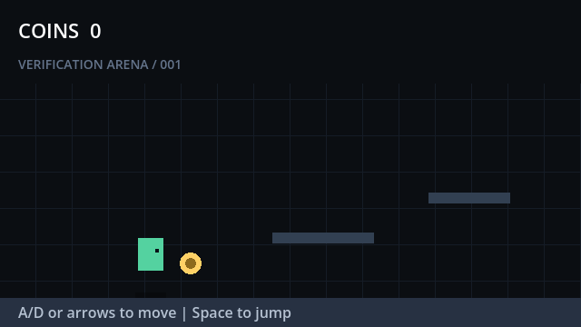

# GameBuddy

> An open-source game coding agent environment that builds, plays, tests, and repairs Godot games.

[Project homepage](https://allegame.github.io/gamebuddy/) · [Architecture](docs/architecture.md) · [Example task](benchmark/tasks/platformer-basic.json)



GameBuddy 的目标不是只生成一组看似合理的游戏代码，而是让 Coding Agent 在受控工程中完成一个可执行闭环：

```text
Understand -> Plan -> Build -> Run -> Play -> Observe -> Repair -> Evaluate
```

当前 `v0.1` 是这个闭环的第一块可运行基础设施，提供：

- Godot 环境探测；
- JSON benchmark task 校验；
- 临时工程副本与 Playtest harness 注入；
- Godot headless 导入和运行；
- 基于 NDJSON 日志的结构化运行时事件；
- 不依赖 LLM Judge 的确定性断言与评分报告；
- 一个无外部素材的 2D 平台跳跃示例。

## Quick Start

要求：

- Node.js 22 或更高版本；
- Godot 4.x，推荐使用控制台版本以保留完整日志。

```powershell
npm test
node ./bin/gamebuddy.js validate ./benchmark/tasks/platformer-basic.json
node ./bin/gamebuddy.js doctor --godot C:\path\to\godot.exe
node ./bin/gamebuddy.js run ./benchmark/tasks/platformer-basic.json `
  --godot C:\path\to\godot.exe `
  --report ./reports/platformer-basic.json
```

也可以设置环境变量，之后省略 `--godot`：

```powershell
$env:GAMEBUDDY_GODOT = "C:\path\to\godot.exe"
npm run demo
```

成功的示例评测会验证：游戏启动、玩家移动、玩家跳跃、金币收集和 Playtest 完成状态。

## Task Format

每个任务明确声明候选工程、需求、外部测试 harness 和规则断言：

```json
{
  "schema_version": 1,
  "id": "platformer_basic_001",
  "project": { "path": "../../examples/platformer-basic" },
  "requirements": [
    { "id": "player_jump", "description": "The player can jump." }
  ],
  "evaluation": {
    "harness": "../harnesses/platformer-basic.gd",
    "timeout_seconds": 15,
    "assertions": [
      {
        "id": "player_jumped",
        "event": "player_jumped",
        "field": "velocity_y",
        "operator": "<",
        "value": 0
      }
    ]
  }
}
```

当前支持的断言操作符为 `exists`、`==`、`!=`、`>`、`>=`、`<`、`<=` 和 `includes`。

## Why External Harnesses?

测试逻辑不放在候选游戏代码中。GameBuddy 会：

1. 将候选 Godot 工程复制到临时目录；
2. 把 benchmark 管理的 harness 注入临时副本；
3. 运行 Godot 导入检查；
4. 由 harness 加载主场景、执行输入并输出状态事件；
5. 删除临时副本并根据事件生成报告。

这样既不会修改原始工程，也能让 ground-truth 测试与 Agent 产物保持清晰边界。

## Repository Layout

```text
gamebuddy/
├── benchmark/
│   ├── harnesses/       # 独立 Playtest 驱动
│   └── tasks/           # 可复现任务规范
├── examples/            # 示例 Godot 工程
├── src/
│   ├── core/            # Task contract
│   ├── evaluation/      # 事件协议与规则评测
│   ├── godot/           # 引擎探测与隔离执行
│   └── runtime/         # 子进程生命周期管理
├── test/
└── docs/
```

## Current Boundary

当前的“隔离”指临时工程副本和受限执行时间，并非安全沙箱。Godot 子进程仍继承当前用户权限和网络访问能力。运行不受信任的 Agent 工程时，应在容器或权限隔离的 worker 中执行。

GameBuddy 现在是 evaluation-first 的基础版本，还没有接入具体大模型、自动编码循环、Artifact Graph、截图理解或资产生成。它们会建立在已经可验证的执行层之上，而不是与第一版耦合。

## Roadmap

- `M0 - Environment`：任务契约、Godot runner、事件协议、规则评测；
- `M1 - Coding Agent`：受控文件工具、Godot 项目检查、实现与修复循环；
- `M2 - Playtest`：键鼠动作 DSL、截图、Node 状态和时间序列断言；
- `M3 - GameBuddy-Bench`：10 个经过人工验证的 2D 核心任务和 baseline；
- `M4 - Project State`：Scene/Script/Resource Artifact Graph 与长任务消融；
- `M5 - Assets and 3D`：资产检索、适配、动画和 Godot 3D。

## License

MIT
